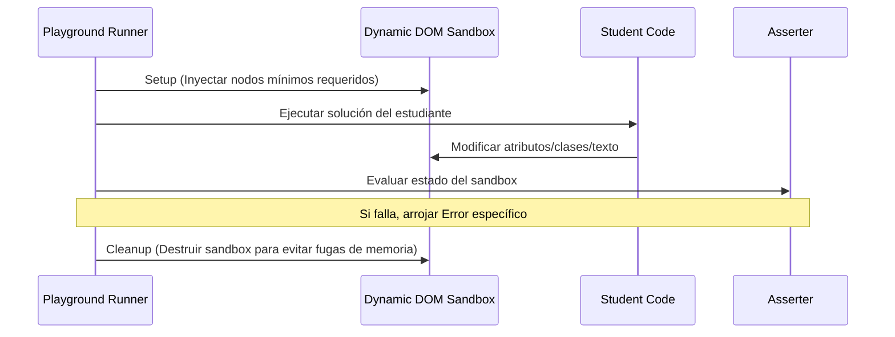

# Documento de Diseño: Integración Masiva del Playground (Clases I-VII)

## 1. Diseño del Mocking y Pruebas del DOM (Módulo VI)
Para probar manipulaciones del DOM en un entorno interactivo sin contaminar la aplicación de manera irreversible, diseñamos una infraestructura de aislamiento del DOM para cada prueba:

### Elementos inyectados para Módulo VI:
- Un elemento con ID `titulo-principal`.
- Dos párrafos con clase `parrafo-estudio`.
- Un botón con ID `boton-estilo`.
- Un contenedor con ID `contenedor-dinamico`.
- Un input con ID `entrada-usuario`.

---

## 2. Refactor de la Clase II (Control de Flujo)
Diseñamos la equivalencia funcional de los 10 scripts imperativos clásicos de la Clase II a funciones puras:

| Ejercicio Original (Imperativo) | Refactor a Función Pura | Firma / Parámetros |
|---|---|---|
| Ej 1: Calificación | `evaluarNota` | `(nota) => void (hace console.log)` |
| Ej 2: Par o Impar | `evaluarParImpar` | `(numero) => void (hace console.log)` |
| Ej 3: Día de la Semana | `obtenerDiaSemana` | `(diaId) => void (hace console.log)` |
| Ej 4: Cuenta regresiva | `cuentaRegresiva` | `() => void` |
| Ej 5: For + Continue | `saltearMultiplosDeCinco` | `() => void` |
| Ej 6: For + Break | `buscarTesoro` | `(cofres) => void` |
| Ej 7: Menu interactivo | `simularMenu` | `() => void` |
| Ej 8: Pirámide asteriscos | `generarPiramide` | `(altura) => void` |
| Ej 9: Fibonacci | `generarFibonacci` | `(terminos) => void` |
| Ej 10: Número Primo | `esNumeroPrimo` | `(candidato) => void` |

---

## 3. Aislamiento del Storage en Módulo V (Persistencia)
Para evitar corromper los datos locales del navegador o colisionar con soluciones de otras clases:
- Cada prueba del Módulo V limpia completamente `localStorage` y `sessionStorage` usando `localStorage.clear()` / `sessionStorage.clear()`.
- Se mockean inputs y se evalúan mediante las APIs nativas del navegador, limpiando todo rastro tras la resolución.
