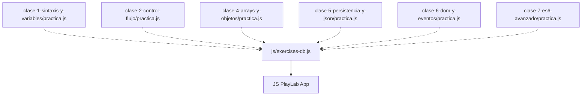

# Especificación Técnica: Integración Masiva del Playground (Clases I-VII)

## 1. Archivos Afectados



- [js/exercises-db.js](file:///home/axel/Escritorio/UTN/Programacion%203/03-estudio-y-practica/js/exercises-db.js): Integrar los 10 ejercicios con teoría enriquecida, código inicial y pruebas para los módulos `js1`, `js2`, `js4`, `js5`, `js6` y `js7`.
- [clase-2-control-flujo/practica.js](file:///home/axel/Escritorio/UTN/Programacion%203/03-estudio-y-practica/clase-2-control-flujo/practica.js): Refactorizar el archivo para declarar los 10 ejercicios en formato de funciones puras correspondientes, con sus respectivos bloques de auto-verificación local alineados para que el estudiante pueda resolverlo tanto desde su editor favorito (VSCode / Vim / Cursor) como desde el navegador de manera 100% idéntica.

---

## 2. Definición del Esquema de Ejercicios en `exercises-db.js`
Cada módulo posee la siguiente firma:
```javascript
jsX: {
    title: "Módulo X: [Nombre Módulo]",
    exercises: [
        {
            id: number, // 1 a 10
            title: string, // Nombre del ejercicio
            theory: string, // HTML enriquecido con teoría
            starterCode: string, // Código de plantilla inicial
            testFnCode: string // Script de validación (aserciones)
        }
    ]
}
```

---

## 3. Estrategia de Pruebas Dinámicas en el Navegador (`testFnCode`)
Para garantizar un testing limpio en el navegador, aplicamos técnicas avanzadas:
1. **Scopes de Aislamiento**: Cada suite de pruebas se concatena con la solución del usuario y se ejecuta dentro de un contexto aislado mediante `new Function()`.
2. **Mocking de Entorno**:
   - Para **Módulo V (LocalStorage)**: Se limpia el storage y se inyectan claves específicas antes del test, y se limpia al finalizar.
   - Para **Módulo VI (DOM)**: Se inyectan elementos HTML con IDs y clases específicas en el documento antes del test, evaluando el resultado de las manipulaciones en tiempo de ejecución, y se remueven de inmediato para evitar contaminación.
3. **Validación Sintáctica y Semántica**: Pruebas explícitas de tipos de datos, valores de retorno exactos y uso correcto de APIs (ej: comprobar que se usó `setTimeout`, `.filter`, `classList.add`, etc.).
